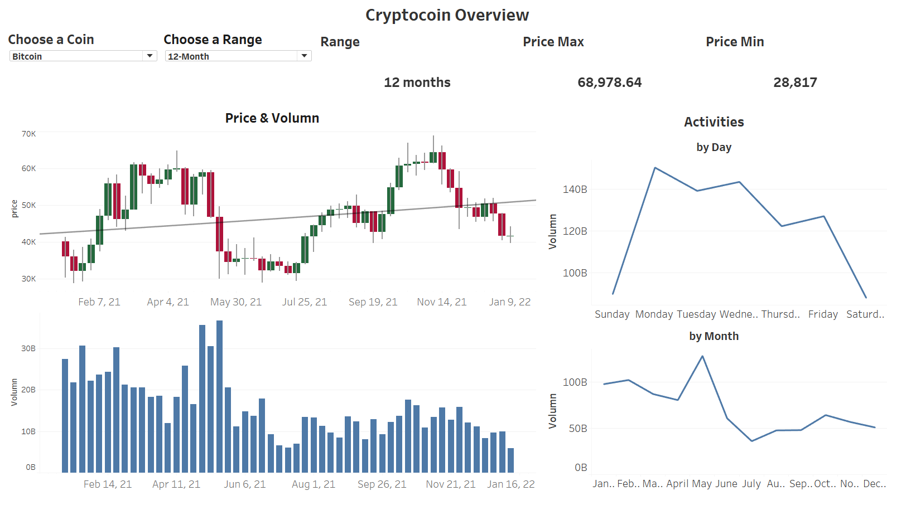
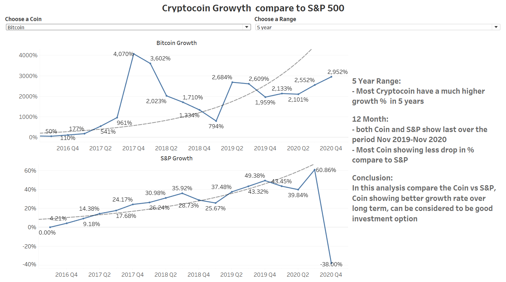
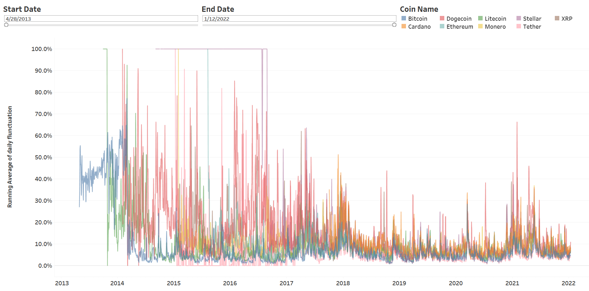

## Dashboard
We will also use Tableau to create and display graphs. We have also created a webpage using Wix. The link to the webpage is [here](https://lavexplorer.wixsite.com/its-crypto).

## Overview
### using the 10 coin historical data to show: 
- the volatilities and volumn
- interactive option to choose the date range the coin from selection
- from the selection, will show the min & max price for the coin the time range selected
- showing the trading activities by day and by month

 

### Compair the Coin vs the S&P Market data for the same period see which has better return

- from the analysis,the coin has a much higher return for the same period

 

### Flunctuation of the Coins  
- the flunctuation of all the coin data we collected over time
- from 2014-2017 is the most active time period for the coins 
 

### 96 hour analysis and prediction
- combine the analysis and the prediction image generated from ML to show if the prediction is close to real data
- its interactive to change the view for the selected coin

 

## link to tableau public
https://public.tableau.com/authoring/CryptoCurrency_16435453604390/CryptoCurrency#1

