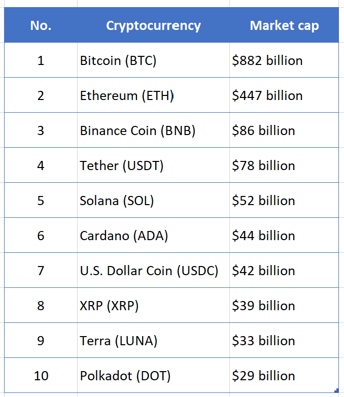
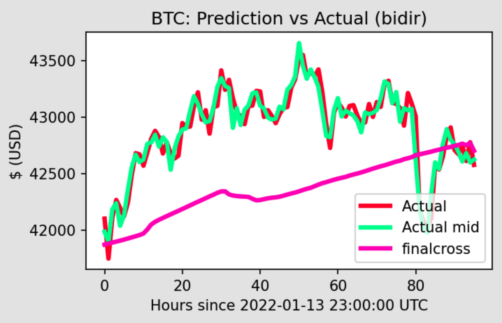

# Crptocurrency Analysis
Use machine learning, R, Python, and Tableau to analyze and forecast popular cryptocurrencies and to analyze trends within the decentralized finance (DeFi) marketplace.

## Project Dashboard
Link to Tableau dashboard [here](https://public.tableau.com/app/profile/jackie.guo1187/viz/CryptoCurrency_16435453604390/CryptoCurrency#1)

## Project Links

Link to Webpage [here](https://lavexplorer.wixsite.com/its-crypto)

Google Slides presentation [here](https://docs.google.com/presentation/d/1B-afhhAZLpZWEUXa2ecDp3Q4k_lRqWVCoqEJYYf4YnM/edit?usp=sharing)

## Overview
Cryptocurrency, a form of decentralized digital money based on blockchain technology has gained lot of popularity in the past few years. As crypto is a highly speculative investment with the potential for intense price fluctuations, experts hold mixed opinions about investing in cryptocurrencies. 

As of Nov. 26, 2021, the combined market value of the world's bitcoins totaled over 1.03 trillion and the global market price of a single bitcoin was $54,572. (Ref: Investopedia) and the market keeps growing.

Following are the top 10 Cryptocurrencies (Ref: Forbes) :

Global adoption of cryptocurrency has taken off in the last year, up 881%, with Vietnam, India and Pakistan firmly in the lead, according to new data from Chainalysis.(Ref: CNBC)

As per triple A, between 2012 and 2021, the price of Bitcoin has increased by over 540,000% and has reached an annual growth of 274% in 2020 and the cryptocurrency market is predicted to grow with an annual growth rate of 56.4% from 2019 to 2025.

Cryptocurrency across industries (Ref: Triple A) clearly proves the growing popularity of cryptocurrencies.
1. Up to 40% of customers pay with cryptocurrency.
2. Number of transactions paid with crypto on e-commerce sites grow by 12.5% every year.
3. Merchants who accept crypto payments saw an average ROI of 327%
4. Digital remittances and cross-border transfers reached almost US$95.96 billion in 2020.
5. Crypto remittance is 388 times faster and 127 times cheaper than traditional remittance methods.
6. 58% cryptocurrency owners are aged under 34.
   
Following are the top 5 countries that have the highest number of crypto owners*Ref: Triple A) :
1. India (100 million)
2. USA (27 million)
3. Nigeria (13 million)
4. Vietnam (5.9 million)
5. United Kingdom (3.3 million)

## Purpose of the Project
Considering the above popularity, it's likely the crypto market will keep growing. In order to predict the future of crytocurrency, it's important to consider factors that impact the prices of the cryptocurrencies (Ref: ).
1. **Supply & Demand**: This is one of the main factors influencing the price of the cryptocurrency. Just like an demand and supply cycle, if the demand is high as compared to the supply. the higher the price and vice versa.

2. **Cost of Extraction(Mining)**: Crytocurrencies are extracted using an intense amount of computer power and electricity. It’s estimated that 0.21% of all of the world’s electricity goes to powering Bitcoin farms.

3. **Rules & Regulations**: If the rules or requirements introduced by national authorities, become quite restrictive or take the form of repression, the price of the cryptocurrency may fall. 

4. **Power of the Media**: Just like the stock market, good news can certainly increase it, while bad news can cause panic, which leads to a quick escape of investors from the market and rapid falls.
   
5. **Financial Crises**: Depends on the economic situation in the concerned countries, If the traditional financial system starts to collapse, people panicly run in other assets.

6. **Celebrity Impact** ([Ref](https://www.trality.com/blog/how-does-cryptocurrency-gain-value)):
A cryptocurrency’s ability to gain value can be helped (or hindered) by stardom. Elon Musk, Jack Dorsey, Mike Tyson, Maisie Williams, Mark Cuban, Snoop Dogg, Steven Seagal, Kanye West, Floyd Mayweather Jr., and Richard Branson are just a handful of celebrity holders of the now famous coin, spanning the worlds of sport, film, music, and business.

## Selected Cryptocurrencies for this Analysis:
1. Binance Coin (BNB)
2. Bitcoin (BTC)
3. Cardano (ADA)
4. Dogecoin (DOGE)
5. Ethereum (ETH)
6. Litecoin (LTC)
7. Monero (XMR)
8. Stellar (XLM)
9. Tether (USDT)
10. XRP (XRP)

## Project Questions to Answer
The following key questions are addressed through this analyis:
1. What is the average age of the top 10 coins by marketcap?
2. Which currencies are the most volatile?
3. Which currencies are the most stable?
4. Using machine learning, can we predict the close price of the 10 selected cryptocurrencies?
5. What is the rate of fluctuations in the prices of the cryptocurrencies in x amount of time?
6. How do cryptocurrencies compare to the broader market?

## Tools Used in the Analysis
As there are many factors that influence the price of the cryptocurrencies, in this analysis we are using the following technology and tools:

**For Data Preprocessing:**
1. Google Colab, Jupyter Notebook
2. Python
3. Libraries: Pandas, NumPy, Matplotlib

**For Data Storage:**
1. MongoDB

**For Machine Learning:**
1. TensorFlow, Keras
2. Bidirectional Long Short-Term Memory Model
3. Sentiment Analysis using Textblob
4. Prophet (in R)

**For the Presentation:**
1. Tableau
2. Flask
3. Webpage using Wix, HTML, CSS

We are also extracting information from various social media sites that contain any comments by celebrities or whales(highest buyers of cryptocurrencies) and run a sentiment analysis to enhance our prediction. 

## Meet the Team

## Psuedocode for the Project
1. Selecting the dataset
2. Preprocessing the database - 
    a. Removing all null values
    b. Removing all irrelevant columns like (name and index no., etc)
    c. Bucketing
    d. Running one-hot encoder and creating a new dataframe
3. Connecting to the provisional database
4. Training the model
5. Using LSTM Bidirectional Layers and a Dense Activation Layer 
6. Changing the number of epochs on the models
7. Storing the results on the database
8. Creating visualizations using Tableau and a webpage using HTML, CSS or bootstrap.

## Description of the Source Data
The data we have gathered is from Kaggle and Data World. The historical cryptocurrency data from Kaggle includes: coin name, symbol, date, high, low, open, close, volume, marketcap. The same metrics were also recorded in the ‘S&P 500 Historical Data’ csv file from Kaggle. The csv files from Data World include common finance metrics for cryptocurrencies, including: coin name, symbol, marketcap, price, volume.
The historical trading data is included for the following coins:

Binance Coin
Bitcoin
Cardano
Dogecoin
Ethereum
Litecoin
Monero
Stellar
Tether
XRP

## Technology Usage Plan (Role X by Jordan)
#### Data Cleaning and Analysis
Python and Pandas will be used to clean the data and perform an exploratory analysis. Further analysis will be completed in Python utilizing dependencies including but not limited to Pandas, NumPy, matplotlib, json. If we have enough time for a sentiment analysis, then Textblob will be used. Additional seasonal trading analysis will be done using Prophet in R.

#### Database Storage
We intend to use MongoDB. MongoDB is a non-relational database and therefore we do not need an ERD. We can connect to the database with PyMongo.

#### Machine Learning
Google Colab will be used to run the machine learning model. The Keras library from Tensor Flow will be utilized. And we plan to use a Bidirectional Long Short-Term Memory (BI-LSTM) model.

#### Dashboard
We will use Tableau to display graphs, charts, and try to tell a story with the data. Ideally, viewers will be able to interact through drop down menus within Tableau. We will also create a webpage using Wix.

## Database Segment 1 (Role: Cirlce by Yutai)
Overview
Find public resources on virtual currencies for non-profit academic research through Kaggle and Data world. We use Pandas to narrow down the data and remove some extraneous information. The preparation of these data will effectively improve the speed and accuracy of data operations, and upload these data to MongoDB.

**Data Selection**
Dataset used : https://www.kaggle.com/sudalairajkumar/cryptocurrencypricehistory

Remove unimportant information such as virtual currency names and symbols.
Reduce the time horizon to nearly five years, reduce the amount of data and improve forecast accuracy.
MongoDB
Upload the sorted data to MongoDB, so that team members can more easily obtain the latest data.

## Database Segment 2 (Lavina Jagwani)

Data Source : https://coinmarketcap.com/api/documentation/v1/#operation/getV1CryptocurrencyListingsLatest

market_cap: CoinMarketCap's market cap rank as outlined in our methodology.
market_cap_strict: A strict market cap sort (latest trade price x circulating supply).
name: The cryptocurrency name.
symbol: The cryptocurrency symbol.
date_added: Date cryptocurrency was added to the system.
price: latest average trade price across markets.
circulating_supply: approximate number of coins currently in circulation.
total_supply: approximate total amount of coins in existence right now (minus any coins that have been verifiably burned).
max_supply: our best approximation of the maximum amount of coins that will ever exist in the lifetime of the currency.
num_market_pairs: number of market pairs across all exchanges trading each currency.
market_cap_by_total_supply_strict: market cap by total supply.
volume_24h: rolling 24 hour adjusted trading volume.
volume_7d: rolling 24 hour adjusted trading volume.
volume_30d: rolling 24 hour adjusted trading volume.
percent_change_1h: 1 hour trading price percentage change for each currency.
percent_change_24h: 24 hour trading price percentage change for each currency.
percent_change_7d: 7 day trading price percentage change for each currency.

File name : Fetch_API_latest_data2.ipynb

Psuedocode :
1. Use URL and API key to fetch data in json format
2. Converted the data from json format to dataframe using json_normalize.
3. Filtered all Nan values and removed columns with null 90% values 
4. Analysis : 
            1. Top 10 cryptocurrencies based on market cap
            2. Top_total_supply_currencies_df
            3. Top_circulating_supply_currencies_df
            4. Top_Percent_90d_df
            5. Top_Percent_60d_df
            6. Top_Percent_30d_df
            7. Top_Percent_7d_df
            8. Top_Percent_24h_df
            9. Top_Percent_1h_df
5. Make this data dynamically availble on the push of a scrape button --- WIP

1. Data Source : kaggle data historical kaggle data

Psuedocode :
1. Filtered all Nan values and removed columns with null 90% values 
2. Analysis : 
            1. Calculate the daily, monthly and yearly fluctuation in closing and opening price
   
3. Make this data dynamically available on the push of a scrape button at a later staget  --- WIP

Data Source : All top 10 bitcoin analysis combined in one file

2. Latest Crypto Data ectracted from cryptocompare using API keys
Psuedocode :
1. Analysis : 
            1. Calculate the daily, monthly and yearly fluctuation in closing and opening price
   
2. Make this data dynamically available on the push of a scrape button at a later stage

3. Crypto Mining data retrieved from Coinwarz and cryptomarket to retrieve the mining difficulty and profitability ratio.
   Merged the mining data in jupyter notebook using pandas in one file for the top 10 currencies by doing a left join in file (Merge_MiningData.ipynb). And then uploading the file onto Mongo DB Atlas. As MongoDb doesn't have the option of doing the join there, the join is done using pandas.

4. Schema of Merged collection on MongoDB Atlas

## Database Integration Segment 2
This project required 2 databases due to large file sizes. Both databases store static data. For example, the databases store static csv files containing historical data for the cryptocurrencies and S&P 500. The database interfaces with the project through PyMongo. We use a MongoDB connection string to access databases and collections. A join was performed.

## Close Price Volatility Analysis

### Technology Used
- MongoDB
- Google Colab
- PyMongo
- Python
- Pandas
- NumPy
- Matplotlib

### Cryptocurrencies Included in Analysis
10 Cryptocurrencies:
1. Binance Coin
2. Bitcoin
3. Cardano
4. Dogecoin
5. Ethereum
6. Litecoin
7. Monero
8. Stellar
9. Tether
10. XRP

+S&P 500 (for context/baseline)

### What is Volatility
Volatility is the annualized standard deviation. To annualize the standard deviation, you multiply it by the square root of the number of trading days in a year (253).

### Close Price Volatility Analysis

### Connecting to the Data (MongoDB)
The historical data for the 10 cryptocurrencies and the S&P500 was stored in the project's MongoDB database. The data was uploaded to the notebook using a MongoDB connection string. The data was then converted to a dataframe using Pandas.

### Filtering the Data for the Selected Years
The dataframe was filtered for the selected year - 2018, 2019, 2020 - respectively. The close price for the selected year was then visualized as a line graph.

### Calculating the Log Return
The NumPy library was used to calculate the daily log return. A new column was added to the selected year's dataframe showing the daily log return of the 'Close' price. 

### Calculating the Annual Percent Volatility (2018-2020)
The volatility is defined as the annualized standard deviation. Thus the standard deviation of the daily log returns was multiplied by the square root of 253 to yield the volatility. The square root of 253 is used because there are approximately 253 trading days per year. The volatiltiy is then multiplied by 100% to get the **annual percent volatility**. The annual percent volatility was then visualized with a histogram using matplotlib.
Note: The S&P 500 was included in this analysis to provide context for the volatility of the 10 cryptocurrencies.

## Annual Percent Volatility from 2018-2020
All 10 cryptocurrencies and the S&P 500 annual percent volatility were visualized with a line graph. The line graph shows the annual percent volatility over a 3 year period, from 2018 to 2020, where each cryptocurrency and the S&P 500 is displayed with its own respective line.

## Results
Please navigate to this [folder](https://github.com/LaviJ/Cryptocurrency-Analysis/tree/main/Volatility%20Analysis/VolatilityAnalysisCharts) to view all resulting charts.

#### Year 2018 Volatility
- Most stable cryptocurrency: Tether
- Most volatile cryptocurrency: Dogecoin

#### Year 2019 Volatility
- Most stable cryptocurrency: Tether
- Most volatile cryptocurrency: Litecoin

#### Year 2020 Volatility
- Most stable cryptocurrency: Tether
- Most volatile cryptocurrency: XRP

#### 3-Year Period (2018-2020) Volatility
- Most stable cryptocurrency: Tether
- Most volatile cryptocurrency: XRP

## Seasonality Analysis

### Prophet: How it Works (Description from Meta Research)
At its core, the Prophet procedure is an additive regression model with four main components:
1. A piecewise linear or logistic growth curve trend. Prophet automatically detects changes in trends by selecting changepoints from the data
2. A yearly seasonal component modeled using Fourier series
3. A weekly seasonal component using dummy variables
4. A user-provided list of important holidays

### Methods
- Using the R prophet package to make a price forecast and analyze seasonality trends in Bitcoin, USD, and the S&P 500.
- Prophet was used to create an additive regression model to forecast 365 days past the end of the modeled time series. 
- Seasonality data was analyzed using the prophet_plot_components() function that is built into the library

### Datasets
- SPY (S&P 500 ETF) 5 years
- Bitcoin (BTC) 5 years
- United States Dollar (USD) 5 years

### Seasonality Analysis Results
Graphical visualizations show the discrepancies in seasonality between USD, Bitcoin, and the S&P 500. The graphs identify unique differences between all of the assets listed above, with USD and the S&P being much more similiar. This could be due to differences between regulated and deregulated asset classes. Please navigate to this [folder](https://github.com/LaviJ/Cryptocurrency-Analysis/tree/main/R_Analysis/Images) to view all resulting graphs.

## Correlation and Risk Analysis
To see more about this analysis, please navigate to this [folder](https://github.com/LaviJ/Cryptocurrency-Analysis/tree/main/Machine%20Learning/Linear%20_Regression)

### Correlation
The percentage change of close price between the ten cryptocurrencies was used to create the heatmap. It shows that all cryptocurrencies have a positive correlation except Tether (USDT).

### Risk and Return
Dogecoin has very high risk and high return compared to the other cryptocurrencies. On the other hand, Tether has the lowest risk and the lowest reward.

## Machine Learning Model Segment 2 (Robert Yokabaskas)
### Random Forest Model
#### Summary of Model
As a Comparison to the Bidirectional LSTM Model, a Random Forest Classifier Model was built to further analyze data.
#### Data Preprocessing
- Set Date as the index for the dataframe
- Split data into training and testing
- Scaled entire dataset using the StandardScaler()

#### Machine Learning Model
Random Forest Regressor Model with 700 initial n-estimator parameters. Altering the n-estimator variable could be the best way for optimization.

#### Practical Application Potential
The buy price and sell price generated from the full 5 year dataset produce extremely skewed prices. Could have potential for more accurate prediction with a smaller dataset or combined with an additional bidirectional machine learning model.

## Machine Learning Model Segment 2 (Role Triangle by Richard)

### Explanation of Model Choice
A **bidirectional long short-term memory (BI-LSTM)** model was selected because it runs the inputs two ways. It runs the inputs from past to future and future to past. Whereas a unidirectional LSTM only preserves information from the past because the only inputs it has seen are from the past.
Bidirectional differs from unidirectional in that the LSTM that runs backwards preserves information from the future, and using the two hidden states combined, you are able at any point in time to preserve information from both past and future. Bidirectional LSTMs tend to show strong results as they can understand context better.

### Preliminary Data Preprocessing

The data is extracted from the source via free authenticated API calls to cryptocompare.com. Data are then fed into a MongoDB database to be retrieved by the machine learning routine.  The Training notebook pulls data from the database and performs a few preprocessing tasks: Rows with zeros are removed. (Data on coins other than BTC will contain zeros until the genesis time of the coin.  Those rows are dropped from the dataset so as to not confuse the algorithm into training on empty data.) The first few years of data is dropped. The following data were retained: close in $ (USD)  The high and low are averaged to obtain a "mid" price value for each datapoint, alongside the period closing value. To produce a simpler model, the trade volume data were stripped from the dataframe. The simpler model, while shallower as a result, is optimized to train solely on the price movements.

### Preliminary Feature Engineering

#### Description of dataset

The dataset comprises hourly price data for each of the 10 selected crypto ticker symbols. This model will utilize hourly data as a method of obtaining signalling with a Δt suitable for making a 4-day-out price trend prediction.  The model can potentially analyze the entire history of each coin, as the datasets all go back to the same point at the start of the BTC blockchain. The entirety of crypto history goes back to January 3rd 2009, 18:15:05h UTC, also known as the Unix Epoch 1231006505, the timestamp of the so-called "Genesis Block", the un-deleteble hard-coded begining of the Bitcoin blockchain. Our dataset begins at the beginning of that hour, the Unix Epoch 1231005600.

#### Preliminary Feature Selction
 

###### Single coin analyzed

In each trained model, only the price data of a single cryptocurrency ticker symbol will be analyzed.  This will make the trained model an expert at the particular coin under test.

###### Financially-significant time-periodic waveforms

The following time periods are reasonably tied to financially significant calendar-based event cycles. These 8 normalized waveforms are loaded into columns beside the two price point columns:
* Daily sine, Daily cosine wave
* Quarterly sine, Quarterly cosine waves
* Annual sine and cosine waves

###### Channel Weighting
The Daily signals are attenuated by .01, while the quarterly and annual waveforms are amplified by 2x and 4x respectively.  The close and mid output are also multiplied by 2x and 3x, respectively.

###### Normalization of price data

The mean and one standard deviation are removed from the price data, as this will optimize attention to the centroid of the price fluctuations.  This process is called normalization and nondimensionalization. The MinMaxScaler is used in this example across the range (-1,1). 

###### Adaptive learning optimizer

* The Adam optimizer is used with a slightly accelerated learning rate of .01 (1E+01 over default).

###### Network topology

A multi-output LSTM model, a LSTM embedded-bidirectional model, and a feedback-regenerative model are explored.  The bidirectional model used in the hourly analysis is based on the LSTM/GRU network in Jaquart, Dann, Weinhardt (2021):  Normalized batches are input to a 256-cell bidirectional LSTM layer, followed by a 50% dropout layer, and an 8-dense neuron with sigmoid activation.

### Splitting the training dataset

The resultant dataframe is split into test batches to monitor performance during the training run.
The training split used in this routine is 70-20-10.

##### Split methodology
The dataframe is split according to the a simple enumeration of the epochal index, as the data is a time series.

### Callback methods
The model will stop early (prior to the 11th epoch) when loss goes significantly unimproved (by monitoring the successive loss delta) for five consecutive runs (the patience factor). For an extended training run, the end-early loss delta value can be reduced and number of epochs increased.

### Results
Please navigate to this [folder](https://github.com/LaviJ/Cryptocurrency-Analysis/tree/main/Machine%20Learning) for more info/results on machine learning.
While the close price prediction results were different for each coin, the machine learning could not predict the close price with high accuracy. Ultimately the model needs more optimization.
To view the predicted vs actual close price, please navigate to this [folder](https://github.com/LaviJ/Cryptocurrency-Analysis/tree/main/Machine%20Learning/Test%201%20Predicted%20vs%20Actual).

## Results : 
1. Half Yearly price fluctuations : We can see the half yearly price fluctuations in the graph below :

2. Model loss of both training and testing is shown to have a major differene as per the below graph: 

3. As we run the model for price prediction, we saw major difference during a certain time frame in the predicted vs the actual price as per the image below: 

4. Predicted vs Actual Price for Bitcoin (from the bidirectional LSTM model run on the hourly data)

## Dashboard Segment 2
Tableau will be used for the dashbaord. The interactive elements incorporated into Tableau will include:
- Filter by coin name
- Select the view by daily, monthly, yearly view to show the volatility and volume
- View of the prediction image created from machine learning

